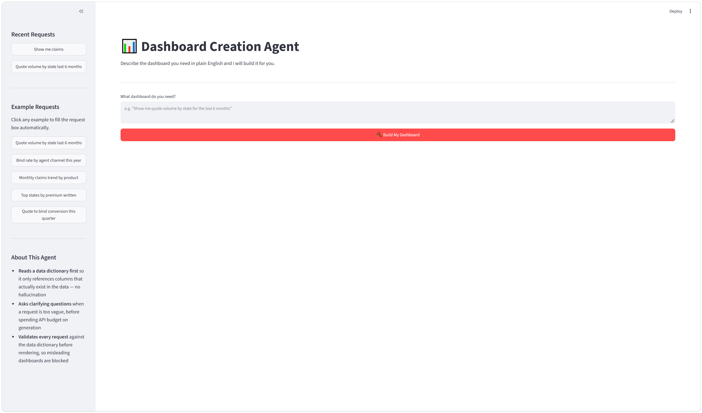

# AI Dashboard Creation Agent

An AI agent that turns a plain-English request into a fully interactive, data-driven HTML dashboard. No SQL, no code, no technical knowledge required.

---

## What This Does

A business user types what they want to see (for example, *"Show me monthly claims trend by product this year"*) and the agent builds it. If the request is too vague, the agent pauses and asks focused clarifying questions before proceeding. Once it understands the request, it reads a data dictionary to learn what data is available, calls the Claude AI API to generate a structured dashboard plan, validates that plan against the real data, and renders a professional interactive chart in the browser.

The entire pipeline, from plain-English request to live dashboard, runs in 5 to 15 seconds. The agent handles insurance data: quotes, policies, and claims. It knows what columns exist, what metrics make sense, and how to group and filter the data. It also knows what data does *not* exist (salaries, headcount, budget) and declines those requests gracefully with a plain-English explanation.

---

## Demo

**Screenshot**



*[If the image above is missing, see `/screenshots/HOW_TO_ADD_SCREENSHOT.txt`]*

---

## AI Concepts Demonstrated

| Concept | What it means in this project |
|---|---|
| **RAG** (Retrieval-Augmented Generation) | Before calling the AI, the agent reads `data_dictionary.md` and injects its full contents into the prompt. This grounds Claude in reality: it can only reference columns and tables that actually exist in the data. This is the primary defense against hallucination. |
| **Prompt Engineering** | All instructions to the AI are stored as separate `.txt` files in `prompts/`. This means the prompt logic can be improved, versioned, or moved to an enterprise AI platform (like Glean) without touching the Python code. |
| **Agentic Workflow** | The system runs multiple steps in sequence (evaluate, clarify, plan, validate, render) rather than answering in one shot. Each step has a clear job and can be improved independently. |
| **Human in the Loop (HITL)** | When a request is too vague, the agent deliberately pauses and asks the user clarifying questions before spending API budget on generation. This is an intentional design choice: ask instead of guess. |
| **Structured Output** | Claude is asked to return a JSON object in a specific format (the "spec"), not a free-form answer. This makes the AI's output machine-readable and directly executable by the renderer. |
| **Self-Evaluation** | After building the dashboard, the agent rates its own confidence (High / Medium / Low) by comparing keywords in the original request to the metric and grouping values it chose. This gives the user transparency into how literally their request was interpreted. |
| **Deterministic vs. Non-deterministic Design** | The AI step (spec generation) is non-deterministic: small wording differences may produce slightly different specs. The renderer is fully deterministic: the same spec always produces the same dashboard. This separation makes the system predictable and testable. |
| **Governance Guardrail** | A dedicated `validator.py` module runs four checks before any dashboard is rendered: it blocks requests for unavailable data, catches hallucinated column names, verifies the spec's JSON structure, and confirms every metric and grouping value is from the approved list. Every result, pass or fail, is logged to an audit file. |

---

## How It Works

1. **User types a plain-English request** in the Streamlit web app or the terminal
2. **Clarifier checks the request**: if it's missing a metric, grouping, or time range, the agent asks focused questions (Human in the Loop)
3. **Spec Generator reads the data dictionary and calls Claude**: Claude returns a structured JSON "spec" describing what charts to build (RAG)
4. **Validator runs four governance checks**: verifies the spec only references real data before a single chart is rendered
5. **Renderer builds the dashboard**: pandas aggregates the data, Plotly draws the charts, and the result is saved as a self-contained HTML file

---

## Tech Stack

- **Python**: all agent logic
- **Streamlit**: web interface
- **Anthropic Claude API** (`claude-sonnet-4-6`): spec generation and clarification
- **Pandas**: data loading, filtering, and aggregation
- **Plotly**: interactive charts (bar, line, pie)
- **python-dotenv**: API key management via `.env` file

---

## Project Structure

```
dashboard-agent/
├── app.py                    Main entry point, Streamlit web UI
├── pipeline.py               Terminal entry point, same pipeline, command-line only
├── clarifier.py              Human-in-the-Loop step: evaluates request clarity
├── spec_generator.py         RAG step: data dictionary + Claude API → JSON spec
├── validator.py              Governance guardrail: four checks before rendering
├── renderer.py               Deterministic renderer: JSON spec → HTML dashboard
├── test_runner.py            Automated stress test: 15 diverse requests, no human needed
├── generate_data.py          One-time script that created the synthetic CSV files
│
├── data_dictionary.md        Business definitions of every table and column (RAG source)
├── data/
│   ├── policies.csv          1,000 synthetic insurance policies
│   ├── quotes.csv            2,703 synthetic quotes (37% bind rate)
│   └── claims.csv            566 synthetic claims
│
├── prompts/
│   ├── spec_generation_prompt.txt   Main prompt template for spec generation
│   ├── correction_prompt.txt        Retry prompt sent when first response is invalid
│   └── clarifier_prompt.txt         Prompt that evaluates request clarity
│
├── specs/
│   ├── spec_format.md        Documentation: the JSON spec format
│   ├── example_spec_1.json   Hand-written example: quote conversion by state
│   └── example_spec_2.json   Hand-written example: claims trend by product
│
├── screenshots/              Add demo screenshot here (see HOW_TO_ADD_SCREENSHOT.txt)
├── output/                   Generated HTML dashboards (gitignored, auto-created on each run)
├── logs/                     Governance audit logs (gitignored, runtime only)
└── learning-notes.md         Personal learning journal: concepts, decisions, interview Q&A
```

---

## Setup and Running

**1. Clone the repository**

```bash
git clone https://github.com/YOUR_USERNAME/dashboard-agent.git
cd dashboard-agent
```

**2. Install dependencies**

```bash
pip install -r requirements.txt
```

**3. Add your Anthropic API key**

Create a file named `.env` in the project root:

```
ANTHROPIC_API_KEY=your-key-here
```

Get a key at [console.anthropic.com](https://console.anthropic.com). The `.env` file is gitignored and never committed.

**4. Run the Streamlit web app**

```bash
python -m streamlit run app.py
```

Opens at `http://localhost:8501`. Type any request in plain English and click **Build My Dashboard**.

**Optional: run from the terminal instead:**

```bash
python pipeline.py "Show me quote volume by state for the last 6 months"
```

---

## What I Learned

Building this project taught me that an AI agent is not a single clever prompt. It is a system of steps, each with a clear job. The clarifier, the spec generator, the validator, and the renderer each do one thing well, and the pipeline wires them together. This separation made every bug easier to find and every improvement easier to make without breaking anything else.

What surprised me most was how important it is to define the contract between the AI and the rest of the system before writing any code. The JSON spec format came first, before the prompt and the renderer. Once I knew exactly what the AI was supposed to produce, I could write a validator to enforce it, a renderer to execute it, and a prompt to generate it. The spec was the anchor. Without it, the project would have been much harder to reason about.

My governance background shaped the design more than I expected. The audit log, the vocabulary check, and the "unavailable data" guard all came naturally from working in a field where you have to be able to explain every decision and prove that guardrails exist. The validator isn't just a technical safety net; it's the layer that makes the system trustworthy enough to put in front of a business user.

The next version of this project connects to a live metadata catalog via MCP (Model Context Protocol), so the data dictionary is always current. Instead of a static markdown file, the agent would query the catalog at runtime to learn what tables and columns exist, making it useful across any dataset, not just the insurance data it was built with.

